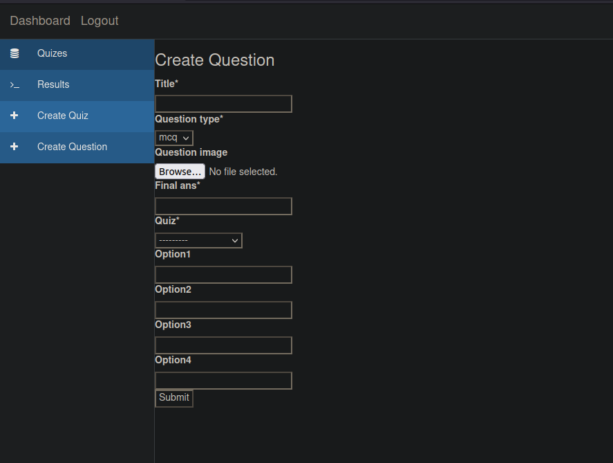
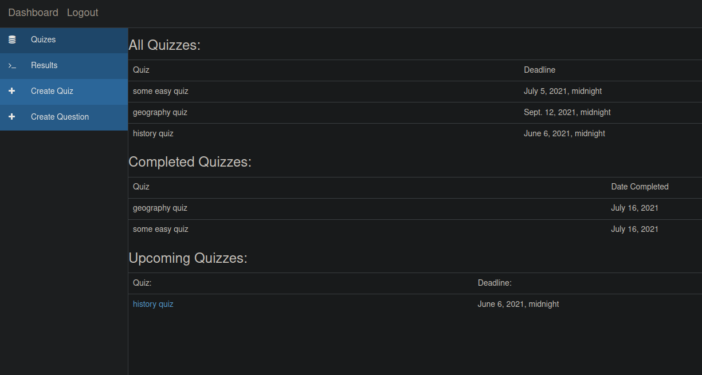

# my-app

## Table of Contents

- [About](#about)
- [Installing](#install)
- [Screenshots](#screenshots)


## About <a name = "about"></a>
 

## Installing <a name='install'></a>

Clone the repository
```
git clone https://github.com/shadyskies/microservices_practice.git
```
cd into quiz app
```
cd quiz_app
```
Install requirements.
```
pip3 install -r requirements.txt
```
## Screenshots <a name='screenshots'></a>




## Usage <a name = "usage"></a>
If you have docker installed:
```
docker-compose up
```
in new terminal:
```
docker-compose exec backend sh
python3 manage.py migrate

```
Else:
```
python3 manage.py runserver
```
Run migrations 
```
python3 manage.py migrate
```